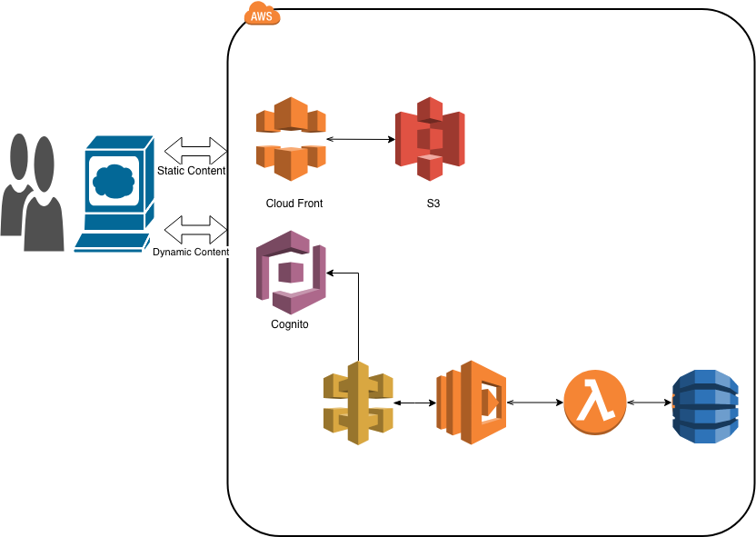

# A Serverless Blog and Profile Application using React, Python and Dynamo DB 

## Components
### AWS
  - AWS S3
  - AWS Clouding
  - AWS Cognito
  -  AWS Lambda
  - AWS CodeBuild
  - AWS Code Pipeline
  - AWS DynamoDB

### JavaScript
  -  React Js
  -  React Router
  -  Babel
  -  Webpack

# Architecture of the Application

